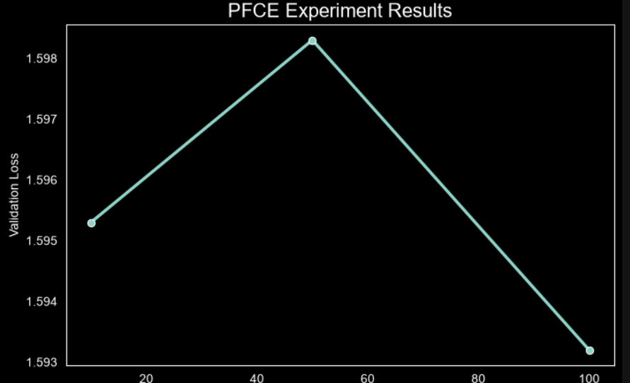

# Weakly Supervised Semantic Segmentation for Remote Sensing Images

## Overview

This project implements a weakly supervised semantic segmentation framework for remote sensing imagery using sparse point annotations instead of full pixel-wise labels.

Traditional semantic segmentation models require dense annotations for every pixel, which are expensive and time-consuming to create. To reduce annotation costs, this project explores point-based supervision combined with a Partial Cross Entropy (PFCE) loss function that trains the model using only a small subset of labeled pixels.

The project was developed using PyTorch and evaluated on the LandCoverAI dataset.

---

## Problem Statement

Semantic segmentation aims to classify every pixel in an image into a semantic category.

Most segmentation methods rely on complete segmentation masks during training. However, obtaining dense pixel-level annotations for remote sensing datasets is expensive and labor-intensive.

This project investigates a weakly supervised learning approach where only a limited number of pixels are labeled for each class.

---

## Dataset

**Dataset:** LandCoverAI

The project uses the LandCoverAI dataset.

Due to dataset size limitations, the dataset is not included in this repository.

Please download the dataset(https://huggingface.co/datasets/dragon7/LandCover.ai) separately and place it in the following structure:

LandCoverAI/
├── images/
├── masks/
└── output/

The dataset contains:

* High-resolution aerial images
* Corresponding land cover segmentation masks
* Multiple semantic classes

To simulate weak supervision, point annotations are generated from the original masks by randomly selecting a fixed number of pixels from each class.

---

## Project Pipeline

```text
Dataset
   ↓
Train / Validation / Test Split
   ↓
Point Annotation Generation
   ↓
UNet Segmentation Network
   ↓
PFCE Loss
   ↓
Training & Evaluation
   ↓
Visualization
```

---

## Features

* Custom PyTorch Dataset Loader
* Point Annotation Simulation
* Weakly Supervised Training
* Partial Cross Entropy Loss (PFCE)
* UNet Segmentation Model
* Training and Validation Pipeline
* Experiment Framework
* Segmentation Visualization
* Performance Analysis

---

## Project Structure

```text
PROJECT
│
├── LandCoverAI
│   ├── images
│   ├── masks
│   ├── output
│   ├── split.py
│   ├── train.txt
│   ├── val.txt
│   └── test.txt
│
├── src
│   ├── dataset.py
│   ├── model.py
│   ├── losses.py
│   ├── metrics.py
│   ├── train.py
│   ├── experiments.py
│   └── visualize.py
│
└── notebook.ipynb
```

---

## Methodology

### 1. Dataset Preparation

Images and masks are loaded using a custom PyTorch Dataset class.

Before training, all images and segmentation masks are resized to:

```text
512 × 512
```

This ensures consistent input dimensions across the entire training pipeline and allows efficient batch processing.

---

### 2. Point Annotation Simulation

Instead of using complete segmentation masks during training, sparse point annotations are generated.

For each semantic class:

* Random pixels are sampled from the original mask.
* Selected pixels remain labeled.
* Remaining pixels are assigned a value of **-1** and ignored during loss computation.

This process creates a realistic weakly supervised learning environment while preserving only a small fraction of the original annotations.

---

### 3. Segmentation Network

A UNet architecture is used for semantic segmentation.

The network consists of:

* Encoder
* Bottleneck
* Decoder
* Skip Connections

The encoder extracts hierarchical features, while the decoder reconstructs high-resolution segmentation maps. Skip connections help preserve spatial information and improve localization accuracy.

---

### 4. Partial Cross Entropy Loss (PFCE)

Traditional Cross Entropy computes the loss using all image pixels.

In weak supervision, labels are available only for selected points. Therefore, a Partial Cross Entropy Loss (PFCE) is used.

The loss is computed only over labeled pixels while ignoring unlabeled regions.

#### PFCE Formula

```text
PFCE = Σ(FocalLoss(Pred, GT) × Mask_labeled)
       --------------------------------------
              Σ(Mask_labeled)
```

Where:

* Pred = model predictions
* GT = ground truth labels
* Mask_labeled = binary mask identifying labeled pixels

This allows effective learning from sparse point annotations.

---

## Experiments

The effect of annotation density was investigated.

Three experiments were conducted using:

* 10 labeled points per class
* 50 labeled points per class
* 100 labeled points per class

### Experimental Objective

The purpose of these experiments is to analyze how the number of available point annotations affects segmentation performance.

### Hypothesis

Increasing the number of labeled points should provide richer supervision and improve segmentation performance.

---

## Results

| Number of Points | Validation Loss |
| ---------------- | --------------- |
| 10               | 1.5953          |
| 50               | 1.5983          |
| 100              | 1.5932          |

The results demonstrate that meaningful segmentation learning can be achieved using sparse point annotations.

Although the performance differences are relatively small, the experiments confirm the feasibility of training segmentation networks with limited supervision.

---

## Visualization

The project includes visualization tools for:

* Input Images
* Ground Truth Masks
* Point Annotation Masks
* Predicted Segmentation Outputs

Example visualizations can be found in the Jupyter Notebook and visualization scripts.



---

## Technologies Used

* Python
* PyTorch
* TorchVision
* NumPy
* Pillow
* Matplotlib
* Pandas
* Seaborn
* Jupyter Notebook

---

## Installation

Clone the repository:

```bash
git clone https://github.com/basmalaazabmohamed-commits/Weakly-Supervised-Semantic-Segmentation-for-Remote-Sensing-Images.git
```

Move into the project directory:

```bash
cd Weakly-Supervised-Semantic-Segmentation-for-Remote-Sensing-Images
```

Install dependencies:

```bash
pip install -r requirements.txt
```

---

## Training

Run the training pipeline:

```bash
python src/train.py
```

---

## Experiments

Run the experimental analysis:

```bash
python src/experiments.py
```

---

## Visualization

Generate segmentation visualizations:

```bash
python src/visualize.py
```

---

## Future Work

Possible future improvements include:

* Semi-Supervised Learning
* Pseudo-Label Generation
* Test-Time Augmentation (TTA)
* Ensemble Learning
* Transformer-Based Segmentation Models
* Histogram Matching
* Self-Supervised Pretraining

---

## Author

**Basmala Azab**


### Areas of Interest

* Artificial Intelligence
* Machine Learning
* Deep Learning
* Computer Vision
* Remote Sensing
* Semantic Segmentation
